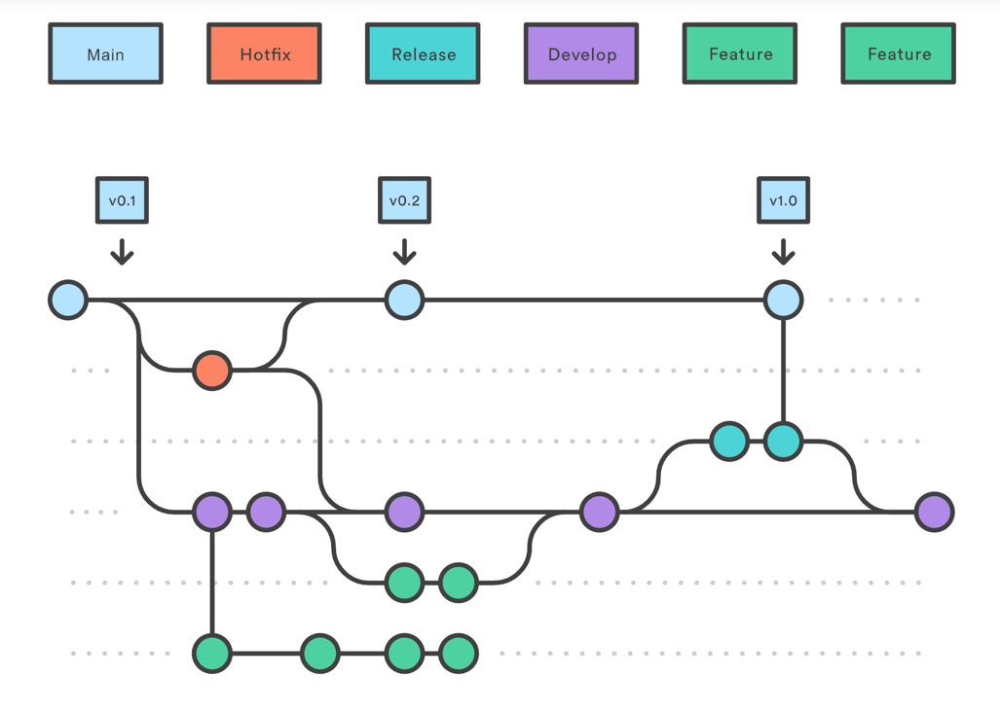

# Contributing

This repo follows a Git Flow, using `main`, `staging`, `develop`, `release/`, `feat/` and `fix/` branches.

Please read this article for more information: https://www.atlassian.com/git/tutorials/comparing-workflows/gitflow-workflow

In summary:

`main` is the trunk of the repo, and is deployed automatically to the Production environment.

`develop` is the current state of development, and is the most common branch to branch from and PR to.

Branches starting with `release/` are cut from `develop`, and mark a release candidate (RC) for a production release.

Releases are merged to `staging` to deploy them to the QA environment. They are then merged to `main` to deploy to the Production environment.

`feat/` and `fix/` branches are created from `develop` and merged back in to `develop` via Pull Requests. At any time, `develop` should be in a state to be able to be deployed.

